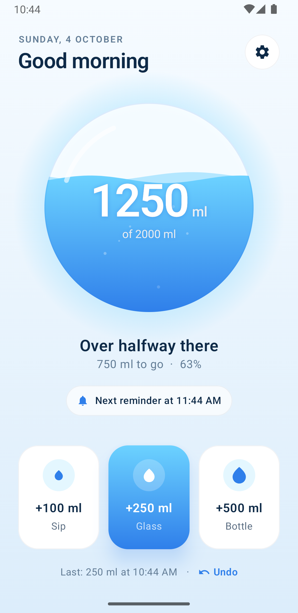
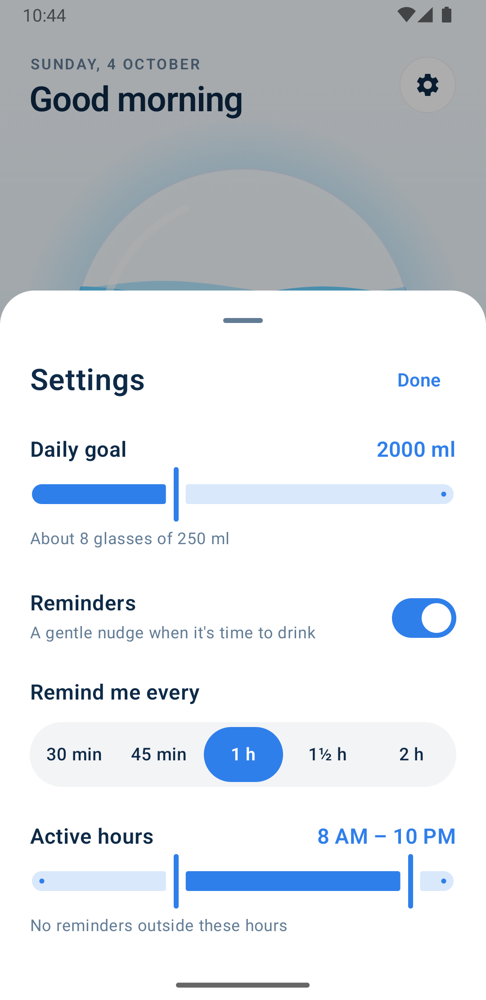
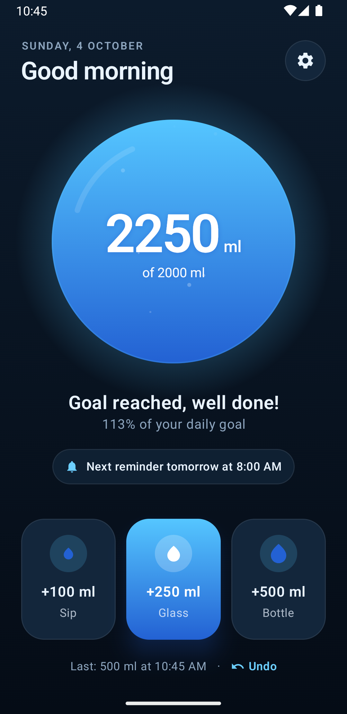

# Wata

A minimal water-drinking reminder. Kotlin Multiplatform + Compose Multiplatform, Android target.

<p align="center">
  
  
  
</p>

- Log a sip (100 ml), glass (250 ml) or bottle (500 ml); undo the last one.
- Reminders fire one interval after your last drink, only within active hours, and pause once the daily goal is reached.
- The notification's **Drank a glass** action logs 250 ml without opening the app.

## Download

Grab the APK from the [latest release](https://github.com/enlob/Wata/releases/latest) and open it on your phone (Android 8.0+). You may need to allow installs from your browser or file manager.

## Structure

- `composeApp/src/commonMain` — all UI and logic (`data/ReminderPlanner.kt` holds the scheduling rules).
- `composeApp/src/androidMain` — platform layer: SharedPreferences store, exact alarms, notifications, boot/time-change receivers.
- `composeApp/src/commonTest` — planner and repository tests.

## Build & install

```bash
./gradlew :composeApp:testDebugUnitTest
```

```bash
./gradlew :composeApp:installRelease
```

Release builds are minified and signed with the key configured in `~/.gradle/gradle.properties` (`WATA_KEYSTORE`, `WATA_KEYSTORE_PASSWORD`, `WATA_KEY_ALIAS`). Without it they fall back to the debug key.
